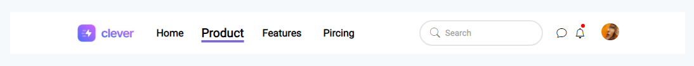

<h1 align="center">😊 BIENVENIDO A MI MENÚ BAR I 😊</h1>

<h2>Descripcion</h2>

Esta es una barra de menú solo con **HTML** y estilos **CSS** 

Se aplicó estilos y animación por CSS. Puede cambiar algunas variables declaradas en el archivo styles.css pra cambiar a su necesidad el color y las imágenes de la barra de menú.

 Some green text 

<i>Variables que puede cambiar en el CSS para dar estilo a su barra de menú</i>
<ul>
    <li> Some green text 
<strong>--colorFont:</strong> Color de todas las fuentes de la barra de menú.</li>
    <li><strong>--colorMain:</strong> Color de los efectos en la barra de menú..</li>
    <li><strong>--colorSecond:</strong> Color de fondo de la barra de menú.</li>
    <li><strong>--colorCircle:</strong> Color de el círculo en el ícono de alarma ('campanita') en la barra de menú.</li>
    <li><strong>--colorPHoldSearch:</strong> Color en el texto de la caja de texto 'Search' mientras que nos se escriba sobre ella, y del ícono de la lupa.</li>
    <li><strong>--imgUsr:</strong> Imagen del usuario que está logueado.</li>
</ul>

El resto de las variables se recomienda no actualizarlas para no estropear el diseño de la barra de menú.
 

Link para poder ver el resultado del código en este repositorio: <a class="aClassMovLeft expand" href="https://jorgekerk.github.io/TP-2022-12-22-MenuBar1/" target="_blank">**Barra de Menú I**</a>

Espero que sea de su agrado, saludos cordiales <i>**JORGE KERK**</i>.
